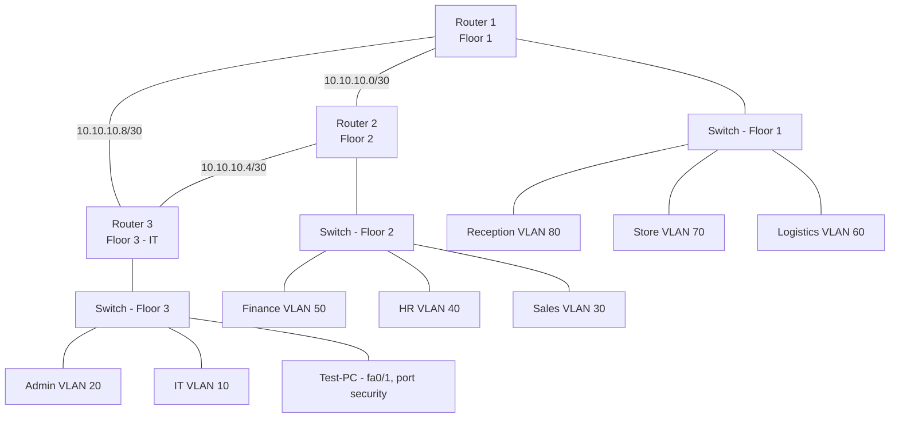

# Vic Modern Hotel — Multi-Floor Enterprise Network

A three-floor hotel network built in Cisco Packet Tracer, implementing inter-VLAN routing (router-on-a-stick), OSPF, DHCP, SSH remote management, and port security.

## Table of contents

- [Project requirements](#project-requirements)
- [Topology](#topology)
- [IP addressing plan](#ip-addressing-plan)
- [Implementation steps](#implementation-steps)
  1. [Physical design and cabling](#1-physical-design-and-cabling)
  2. [Router serial interfaces and clocking](#2-router-serial-interfaces-and-clocking)
  3. [Switch VLANs and port modes](#3-switch-vlans-and-port-modes)
  4. [Router subinterfaces (router-on-a-stick)](#4-router-subinterfaces-router-on-a-stick)
  5. [DHCP configuration](#5-dhcp-configuration)
  6. [OSPF routing](#6-ospf-routing)
  7. [SSH remote access](#7-ssh-remote-access)
  8. [Port security](#8-port-security)
- [Verification](#verification)
- [Troubleshooting log](#troubleshooting-log)
- [Lessons learned](#lessons-learned)

---

## Project requirements

Vic Modern Hotel has three floors:

| Floor | Departments |
|---|---|
| 1st | Reception, Store, Logistics |
| 2nd | Finance, HR, Sales/Marketing |
| 3rd | IT, Admin |

Design constraints:

1. Three routers, one per floor, all physically housed in the IT server room.
2. Routers interconnected via serial **DCE** cable.
3. Router-to-router links use `10.10.10.0/30`, `10.10.10.4/30`, `10.10.10.8/30`.
4. One switch per floor.
5. WiFi per floor for laptops and phones.
6. One printer per department.
7. Each department is its own VLAN (table below).
8. OSPF advertises all routes.
9. All devices obtain IPs dynamically; each floor's router is the DHCP server.
10. Full any-to-any device communication.
11. SSH enabled on all routers for remote login.
12. A `Test-PC` on the IT switch's `fa0/1`, used to validate SSH.
13. Port security on the IT switch's `fa0/1`, sticky MAC, violation mode `shutdown`.

---

## Topology



Each router connects to its floor's switch over a single trunk link and routes between VLANs using subinterfaces (router-on-a-stick).

---

## IP addressing plan

### VLANs and subnets

| Floor | Department | VLAN | Network | Gateway (router subinterface) |
|---|---|---|---|---|
| 1 | Reception | 80 | 192.168.8.0/24 | 192.168.8.1 |
| 1 | Store | 70 | 192.168.7.0/24 | 192.168.7.1 |
| 1 | Logistics | 60 | 192.168.6.0/24 | 192.168.6.1 |
| 2 | Finance | 50 | 192.168.5.0/24 | 192.168.5.1 |
| 2 | HR | 40 | 192.168.4.0/24 | 192.168.4.1 |
| 2 | Sales/Marketing | 30 | 192.168.3.0/24 | 192.168.3.1 |
| 3 | Admin | 20 | 192.168.2.0/24 | 192.168.2.1 |
| 3 | IT | 10 | 192.168.1.0/24 | 192.168.1.1 |

### Router-to-router serial links

| Link | Network | Router A | Router B | DCE end |
|---|---|---|---|---|
| R1 – R2 | 10.10.10.0/30 | .1 | .2 | (set per topology) |
| R2 – R3 | 10.10.10.4/30 | .5 | .6 | (set per topology) |
| R1 – R3 | 10.10.10.8/30 | .9 | .10 | (set per topology) |

> Run `show controllers serial <interface>` to confirm which end is DCE before applying `clock rate`.

---

## Implementation steps

### 1. Physical design and cabling

- Router ↔ Router: serial **DCE** cable
- Router ↔ Switch: copper straight-through cable
- Switch ↔ end devices: copper straight-through cable

### 2. Router serial interfaces and clocking

```
Router> enable
Router# configure terminal
Router(config)# interface se0/2/0
Router(config-if)# ip address 10.10.10.1 255.255.255.252
Router(config-if)# clock rate 64000        ! only on the DCE end
Router(config-if)# no shutdown
Router(config-if)# exit
Router(config)# interface gig0/0
Router(config-if)# no shutdown
```

Clocking is required because there is no external CSU/DSU in a lab environment — one end of the serial link has to generate the timing signal both sides synchronize to. Only the DCE end runs `clock rate`; the DTE end just listens.

Repeat for each router and each serial link.

### 3. Switch VLANs and port modes

Access ports (facing end devices):

```
Switch> enable
Switch# configure terminal
Switch(config)# interface range fa0/2-4
Switch(config-if)# switchport mode access
Switch(config-if)# switchport access vlan 80
Switch(config-if)# exit
Switch(config)# do write
```

Trunk port (facing the router):

```
Switch(config)# interface fa0/1
Switch(config-if)# switchport mode trunk
Switch(config-if)# exit
Switch(config)# do write
```

**Why trunk and not access:** an access port belongs to exactly one VLAN and strips any tag before forwarding — it cannot carry more than one VLAN's traffic. Since the router-facing link must carry every VLAN on that floor simultaneously (tagged with 802.1Q), it has to be a trunk. Leaving the port on its default (`dynamic auto`) is not a safe substitute — the switch will try to negotiate trunking via DTP, the router won't respond (routers don't speak DTP), negotiation times out, and the port silently falls back to untagged access mode on VLAN 1 — breaking every VLAN except one.

### 4. Router subinterfaces (router-on-a-stick)

```
Router(config)# interface gig0/0.80
Router(config-subif)# encapsulation dot1Q 80
Router(config-subif)# ip address 192.168.8.1 255.255.255.0
Router(config-subif)# exit
Router(config)# do write
```

Repeat once per VLAN on that router.

**Why subinterfaces instead of one physical interface per VLAN:** a router only has 2–3 onboard Ethernet ports, but each floor has 2–3 VLANs — dedicating one physical port per VLAN doesn't scale and wastes cabling. A subinterface is a logical split of one physical link; `encapsulation dot1Q <id>` tells it which tagged frames to claim, and each subinterface gets its own IP address inside its VLAN's subnet, acting as that VLAN's gateway.

### 5. DHCP configuration

```
Router(config)# service dhcp
Router(config)# ip dhcp pool Reception
Router(dhcp-config)# network 192.168.8.0 255.255.255.0
Router(dhcp-config)# default-router 192.168.8.1
Router(dhcp-config)# dns-server 8.8.8.8
Router(dhcp-config)# exit
Router(config)# do write
```

> `default-router` takes only IP address(es) — never a subnet mask. Only `network` takes a mask, since it defines the pool's scope. Passing a mask to `default-router` produces `% Invalid input detected`.

Repeat once per VLAN on that router.

### 6. OSPF routing

```
Router(config)# router ospf 10
Router(config-router)# network 192.168.8.0 0.0.0.255 area 0
Router(config-router)# network 10.10.10.0 0.0.0.3 area 0
Router(config-router)# exit
Router(config)# do write
```

Advertise every directly connected VLAN and every serial link on that router.

- The process ID (`10`) is only locally significant — it does not need to match between routers.
- The area number **does** need to match on both ends of a link, or the neighbors won't form an adjacency. This project uses a single flat `area 0` (the mandatory backbone area) across all routers, which is standard for a network this size.
- Without OSPF (or static routes as a manual alternative), each router only knows its own directly connected networks — devices on different floors would have no path to each other at all.

### 7. SSH remote access

```
Router(config)# hostname R1-Floor1
Router(config)# ip domain-name vicmodernhotel.local
Router(config)# username admin password cisco123
Router(config)# crypto key generate rsa
How many bits in the modulus [512]: 1024
Router(config)# line vty 0 15
Router(config-line)# login local
Router(config-line)# transport input ssh
Router(config-line)# do write
```

Dependency order matters:

1. `hostname` + `ip domain-name` — required before `crypto key generate rsa` will run at all (the key pair is named `<hostname>.<domain>`).
2. `crypto key generate rsa` — generates the key pair; SSH is enabled automatically the moment this succeeds.
3. `username` — populates the local database `login local` will check against.
4. `line vty 0 15` + `login local` + `transport input ssh` — enforces authenticated, SSH-only access on all 16 VTY lines (blocks Telnet outright).

> `crypto key generate rsa 1024` is invalid syntax — the modulus size is never a direct argument. Run `crypto key generate rsa` with no arguments and answer the interactive prompt instead.

### 8. Port security

```
Switch(config)# interface fa0/1
Switch(config-if)# switchport mode access
Switch(config-if)# switchport port-security
Switch(config-if)# switchport port-security maximum 1
Switch(config-if)# switchport port-security mac-address sticky
Switch(config-if)# switchport port-security violation shutdown
Switch(config-if)# do write
```

- `switchport port-security` — the master switch; without it every other port-security line has no effect.
- `maximum 1` — only one MAC address may use this port.
- `mac-address sticky` — the switch learns Test-PC's MAC on first connection and locks it in, instead of it being typed manually.
- `violation shutdown` — any second/different MAC puts the port into `err-disabled` until an administrator manually re-enables it.

Port security only applies to access ports, hence `switchport mode access` first.

---

## Verification

```
show ip interface brief          ! interface status and IPs
show vlan brief                  ! VLAN membership per port
show interfaces trunk            ! confirm trunk state, allowed VLANs
show ip route                    ! confirm OSPF-learned routes (O)
show ip ospf neighbor            ! confirm adjacency with other routers
show controllers serial <int>    ! confirm DCE/DTE and clocking
show port-security interface fa0/1
ssh -l admin 192.168.1.1         ! test remote login from Test-PC
```

---

## Troubleshooting log

Real errors hit during implementation, kept here for reference:

| Command attempted | Error | Fix |
|---|---|---|
| `crypto key generate rsa 1024` | `% Invalid input detected at '^' marker` | Run `crypto key generate rsa` with no size argument; answer the modulus prompt interactively |
| `default-router 192.168.3.1 255.255.255.0` | `% Invalid input detected at '^' marker` | `default-router` takes only an IP address, no mask |
| `switchport port-security maximum 1` (before enabling) | Silently had no effect | Must run `switchport port-security` first to enable the feature |
| Leaving switch↔router link on default mode | VLANs other than the negotiated fallback stopped routing | Explicitly set `switchport mode trunk` — don't rely on DTP negotiation with a router |

---

## Lessons learned

- Plan the full IP/VLAN table before touching the CLI — most config errors traced back to typing addressing on the fly.
- `do wr` after every logical block (not just at the end) avoids losing work to accidental reloads.
- Router process IDs and area numbers serve different purposes in OSPF: process ID is cosmetic/local, area number must match across a link.
- Always confirm the DCE end with `show controllers serial` before configuring `clock rate` — guessing wrong means the link never comes up.
